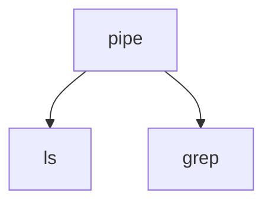

# Pipe

`pipe`管道是用于进程间通信的关键手段，典型的使用范例

```sh
ls | grep filename
```

`pipe`进程会创建两个子进程，`ls`和`grep`，结构如下：




`ls`和`grep`都是进程，`ls`会将结果输出到`stdout`中，而`grep`则会从`stdin`中获取输入。

通过`pipe`管道可以将`ls`的输出与`grep`的输入连接。

连接的主要思想是通过重写`file descriptor`文件描述符实现的。

> **文件描述符：**
>
> file descriptors table由用户进程所有，每个进程都有一个这样的表，这里记录了进程打开的文件所代表的fd，fd的值映射到file table中的条目(entry)。
>
> 另外，每个进程都会预留3个默认的fd: stdin、stdout、stderr;它们的值分别是0、1，2。
>
> | Integer value |                          Name                           | symbolic constant | file stream |
> | :-----------: | :-----------------------------------------------------: | :---------------: | :---------: |
> |       0       |  [Standard input](https://en.wikipedia.org/wiki/Stdin)  |   STDIN_FILENO    |    stdin    |
> |       1       | [Standard output](https://en.wikipedia.org/wiki/Stdout) |   STDOUT_FILENO   |   stdout    |
> |       2       | [Standard error](https://en.wikipedia.org/wiki/Stderr)  |   STDERR_FILENO   |   stderr    |

`pipe`正是通过修改`ls`进程编号为1的`fd`与`grep`进程编号为0的`fd`实现的连接。

```c
case PIPE:
    pcmd = (struct pipecmd*)cmd;
    if(pipe(p) < 0)
      panic("pipe");
    if(fork1() == 0){
      close(1);
      dup(p[1]);
      close(p[0]);
      close(p[1]);
      runcmd(pcmd->left);
    }
    if(fork1() == 0){
      close(0);
      dup(p[0]);
      close(p[0]);
      close(p[1]);
      runcmd(pcmd->right);
    }
    close(p[0]);
    close(p[1]);
    wait(0);
    wait(0);
    break;
```

核心就在对`|`左侧的进程`pcmd->left`的`close(1)`与`dup(p[1])`，对右侧进程`pcmd->right`的`close(0)`与`dup(p[0])`

下面为`sys_close`系统调用的代码，在对`|`左侧的进程`pcmd->left`的`close(1)`时会进入该系统调用

```c
uint64
sys_close(void)
{
  int fd;
  struct file *f;

  if(argfd(0, &fd, &f) < 0)
    return -1;
  // 可以看到close(1)最后会进入这里
  // sys_close(void), fd=1
  // myproc获取当前进程，ofile即位该进程的文件描述符表，置stdout也就是编号为1的文件描述符为0
  myproc()->ofile[fd] = 0;
  fileclose(f);
  return 0;
```

随后使用`dup(0)`进入`sys_dup`系统调用

```c
uint64
sys_dup(void)
{
  struct file *f;
  int fd;
  // dup(p[1])
  // sys_dup, fd=p[1], f为文件描述符p[1]对应的文件
  if(argfd(0, 0, &f) < 0)
    return -1;
  // 为f再分配一个文件描述符，进入fdalloc函数中
  if((fd=fdalloc(f)) < 0)
    return -1;
  filedup(f);
  return fd;
}
```

```c
static int
fdalloc(struct file *f)
{
  int fd;
  struct proc *p = myproc();
  // 自fd为0开始进行配分，而刚刚通过close(1)操作置stdout也就是编号为1的文件描述符为0
  // 因此在此处将ofile[1]置为f，也就是将该进程的stdout修改为了文件f
  for(fd = 0; fd < NOFILE; fd++){
    if(p->ofile[fd] == 0){
      p->ofile[fd] = f;
      return fd;
    }
  }
  return -1;
}
```

右侧进程`pcmd->right`通过类似的操作也修改了`stdin`，至此`pcmd->left`的输出和`pcmd->right`的输入就连接了起来。


