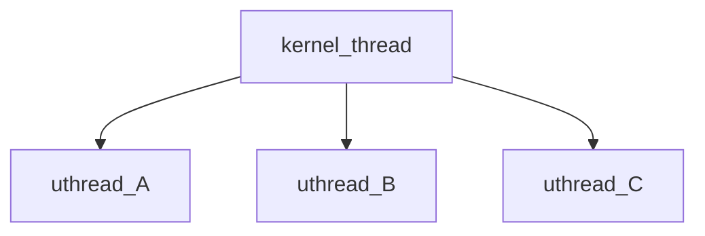

## 实验内容
### Uthread： switching between threads

此实验要求实现一个用户级线程（简单来说是一个携程机制）。
#### 相同点：为什么说 `uthread` 就是协程？

1. **协作式调度 (Cooperative Scheduling)** 这是最核心的共同点。`uthread` 库中的线程不会被强制剥夺 CPU 时间（即没有“抢占” Preemption）。一个 `uthread` 会一直运行，直到它自己明确地调用 `uthread_yield()` 主动放弃 CPU。同样，协程也是通过 `yield`, `await` 等关键字主动放弃执行权，让调度器去运行其他协程。两者都是“我自愿让出，你才能运行”的模式。
2. **用户态管理 (User-Level Management)** `uthread` 的创建、销毁和调度逻辑完全在用户空间的代码库里实现，操作系统内核对此一无所知。协程也是如此，它的调度器（event loop 或 aysncio runtime）运行在用户态，内核只知道那个承载了所有协程的单一系统线程。
3. **轻量级上下文切换 (Lightweight Context Switch)** 因为不涉及内核，`uthread` 之间的切换只需要保存和恢复通用寄存器（如 `ra`, `sp`, `s0-s11` 等），这个过程非常快。协程的切换也同样轻量，因为它也不需要陷入内核（trap）。

在`user space`完成`uthread`的创建和切换。
- 每个`uthread`都应该拥有自己独立的`stack`
- `uthread`主动调用`yield`进行`uthread`之间的切换

**与kernel_thread调度的区别**
==kernel_thread调度==
- `kernel_thread`的调度都是通过trap进入`schedule`进行调度的
	- trap发生时会将当前线程的`pc`记录到`stvec`寄存器中，之后使用该值恢复执行
	- 通过`trampoline`保存其它寄存器
==user_thread调度==
- 通过调用函数`yield`(最终调用`thread_schedule`) 完成调度
	- `pc`值已经变了，也没有硬件帮助保存，因为是单纯的函数调用
	- 但是因为是单纯的函数调用，所以`ra`寄存器记录了返回地址，可以帮助恢复执行
	- 需要手动保护一些寄存器，还有`ra`,`sp`。
