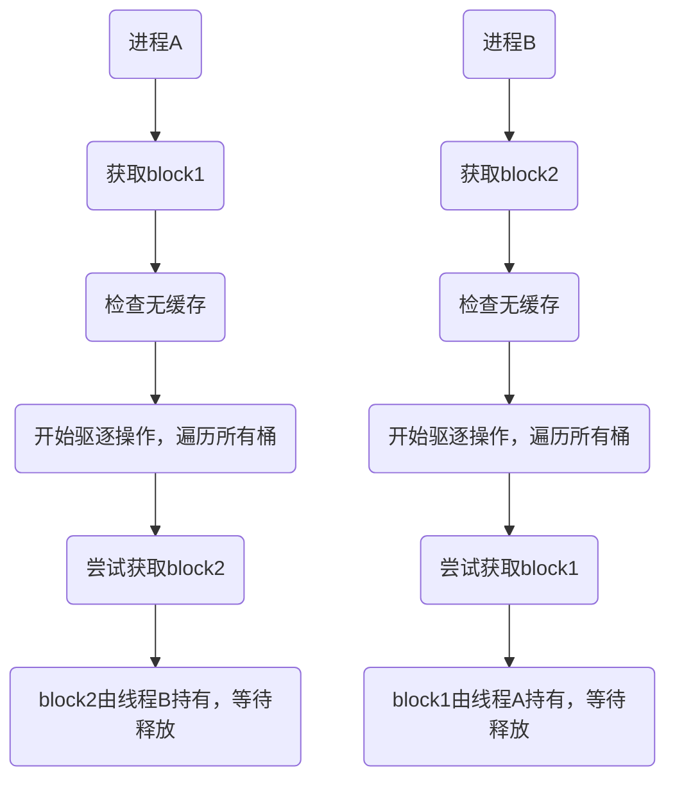
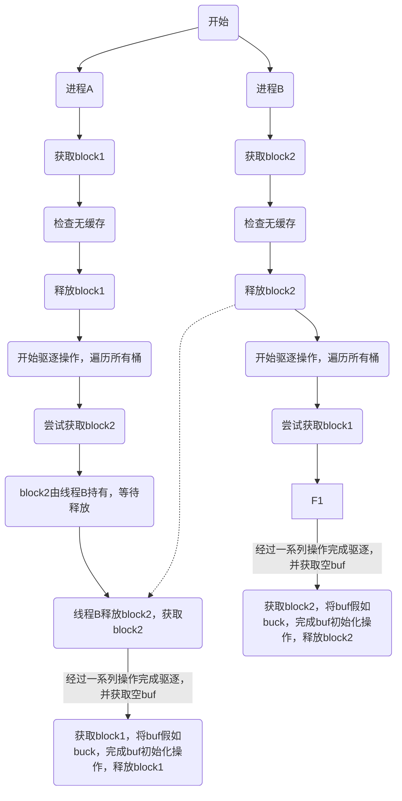
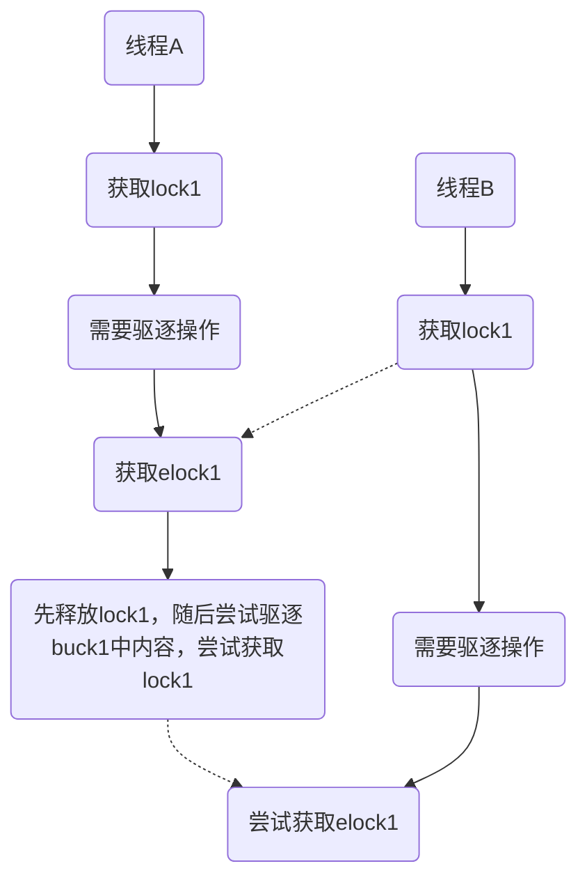

## 读书笔记
xv6读书笔记
> 笔记范围：Chapter-6，Section 8.1 ~ 8.3

### 锁和中断
进程的代码本身和中断处理程序可能会持有同样的锁
**核心区别：线程上下文 vs. 中断上下文**
为了彻底搞清楚这个问题，我们必须区分这两种上下文：
#### 1. 线程上下文 (Thread Context)
- **这是什么？** 这是内核代码代表一个特定进程（在 xv6 中即一个内核线程）正常执行时的状态。比如，当一个进程通过系统调用进入内核后，内核为其执行服码就运行在线程上下文中。
    
- **特点：**
    
    - **可调度 (Schedulable):** 它可以被调度器暂停和恢复。
        
    - **可睡眠 (Can Sleep):** 它可以因为等待某个资源（如磁盘 I/O）而调用 `sleep()` 主动放弃 CPU。当它调用 `sleep()` 时，调度器会选择另一个线程来运行。
        
    - **可被中断:** 它的执行可以被硬件中断随时打断。
        

#### 2. 中断上下文 (Interrupt Context)

- **这是什么？** 当一个硬件（如定时器、磁盘、键盘）发来中断信号时，CPU 会强制暂停当前正在执行的任何代码，转而去执行预先注册好的中断处理程序。这个执行环境就是中断上下文。
    
- **特点：**
    
    - **异步执行 (Asynchronous):** 它的发生时间是不可预测的，完全由外部硬件决定。
        
    - **不可调度 (Not Schedulable):** 它不能被调度。它只是“借用”了当前被中断线程的内核栈（虽然有些系统会切换到专门的中断栈），但它本身不是一个线程。
        
    - **不可睡眠 (Cannot Sleep):** 进入会关闭操作系统对设备中断的响应，因此中断上下文将无法退出，进入中断上下文后，中断上下文将一直占据`cpu`直到中断处理程序结束，打开对设备中断的响应

### 为什么这个区别对锁（Lock）至关重要？

现在我们来看，如果一个锁保护的数据被这两种上下文同时使用，会发生什么可怕的事情。这正是 xv6 book 那句话要警示的**死锁风险**。

请看以下致命场景：

1. 一个内核线程 T1 在**线程上下文**中运行，它成功获取了自旋锁 `lk`，正准备操作被保护的数据。
    
    ```C
    // 运行在线程 T1 的上下文中
    acquire(&lk); // 成功获取锁
    // ... 准备操作数据 ...
    ```
    
2. 就在此时，T1 还没有释放锁 `lk`，一个硬件中断（比如定时器中断）在同一个 CPU 核上发生了。
    
3. CPU 硬件强制暂停线程 T1，转而去执行对应的**中断处理程序**。代码现在进入了**中断上下文**。
    
4. 不幸的是，这个中断处理程序也需要访问被 `lk` 保护的同一份数据，于是它也尝试去获取锁 `lk`。
    
    ```C
    // 运行在中断上下文中
    acquire(&lk); // 尝试获取锁
    ```
    
5. **死锁发生！**
    
    - 中断处理程序发现锁 `lk` 已经被线程 T1 持有，所以它开始“自旋”（在一个循环里空转），等待 T1 释放锁。
        
    - 但是，线程 T1 已经被中断处理程序暂停了，它**永远不可能**有机会运行并释放锁 `lk`。
        
    - 结果：中断处理程序永远在等待一个永远不会被释放的锁，而被它中断的线程 T1 永远也得不到恢复。**整个 CPU 核就此被锁死。**

### xv6 的解决方案

为了防止这种致命的死锁，xv6 规定了一种特殊的 `acquire` 锁的方式。当一个锁可能被中断处理程序使用时，在获取这个锁之前，**必须先在当前 CPU 核上禁用中断**。

xv6 的 `acquire()` 函数内部通过调用 `pushcli()` 来实现禁用中断。

```C
// acquire in spinlock.c
void
acquire(struct spinlock *lk)
{
  pushcli(); // 关键！在尝试获取锁之前，先禁用中断
  if(holding(lk))
    panic("acquire");

  while(xchg(&lk->locked, 1) != 0)
    ;
  
  // ...
}
```

这样一来，上面的死锁场景就不会发生： 因为线程 T1 在持有锁 `lk` 的期间，中断是禁用的，所以中断处理程序根本没有机会运行来尝试获取同一个锁。当中断被重新启用时（在 `release()` 函数中），锁 `lk` 肯定已经被释放了。

## 实验/锁优化

整体感受下来这个lab还是相当有难度的，这里的难度并不是指通过测试的难度。因为实验本身的测试相对较弱，实际测试中部分锁冲突行为发生的不多，因此很难检测出一些问题。一些非常典型的错误设计也能通过实验。
> tests can only prove the presence of features, not the absence of bugs

### Buffer Cache
>如果多个进程密集地使用文件系统，它们之间会争用`bachce.lock`。`bcache.lock`的作用时保护磁盘块的缓存（buffer），以避免发生如下的冲突情况：
>- 避免对同一个磁盘块建立多个缓存
>- 避免修改缓存冲突（`ref++`, 修改指针等情况）

**实验目标**
实验目标是完成对`bcache.lock`机制的优化。
- 降低锁的粒度，大锁化小锁
```c
struct {
struct spinlock lock;
struct buf buf[NBUF];
// Linked list of all buffers, through prev/next.
// Sorted by how recently the buffer was used.
// head.next is most recent, head.prev is least.
struct buf head;
} bcache;
```

**原本的设计**：
- 通过一个`lock`锁来完成`bcache`的冲突控制
- 通过双向链表管理`buf`，实现`LRU`的驱逐策略
- 每次尝试获取`blockno`时，会遍历这个双向链表
	- 存在，直接返回，并`ref++`
	- 不存在，则找到最久未使用且`ref=0` 的`buf` 作为缓存

**实验思路**：
重点是将`buf`资源切分（切成多个`buck`），通过哈希将每个 `blockno`固定映射到一个`buck`中，并对每个`buck`单独加锁，来降低锁粒度。但要注意当桶内资源不足时，要从其它的桶中获取`buf`
> 实验思路是比较明晰的，但是由于涉及到从其它桶内获取`buf`，在这个过程中很容易存在可能的死锁活为同一个`block`重复分配`buf`的问题
#### 实验思路一
>  这种实验思路可能存在死锁的风险

**结构设计**
对实验思路的直接实现，没有引入其它元素
```c
#define NBUCK 17

struct {
struct spinlock bucklock[NBUCK];
struct buf buf[NBUF];

// Linked list of all buffers, through prev/next.
// Sorted by how recently the buffer was used.
// head.next is most recent, head.prev is least.
struct buf head[NBUCK];
} bcache;
```

bget(uint dev, uint blockno) 中，首先在 blockno 对应桶中扫描缓存是否存在，如果不存在，则在**所有桶**中寻找一个最近最久未使用的无引用 buf，进行缓存驱逐，然后将其重新移动到 blockno 对应的桶中（rehash），作为 blockno 的缓存返回。

**实现思路**：
```c
static struct buf*
bget(uint dev, uint blockno)
{
  // 先获取桶lock，检测是否已经在桶内
  buck = (dev + blockno) % NBUCK;
  acquire(&bcache.bucklock[buck]);
  
  // 检查是否存在缓存
  for(b in bcache.head[buck]){
    if(b->dev == dev && b->blockno == blockno){
      b->refcnt++;
      release(&bcache.bucklock[buck]);
      setup(b);
      return b;
    }
  }

  for (int i in [0, NBUCK]) {
    acquire(&bcache.bucklock[i]);
    for (b in bcache.head[i]){
      if(b->refcnt == 0) {
        // 完成驱逐操作
        evict();
        release(&bcache.bucklock[i]);
        goto evicted; // 直接跳转，避免重复release
      }
    }
    release(&bcache.bucklock[i]);
  }

evicted:
  if (b)
    // 将b假如到buck桶内
    append(bcache.head[buck], b)
    // 设置b的属性
    setup(b);
	release(&bcache.bucklock[buck]);
    return b;

  release(&bcache.bucklock[buck]);
  panic("NO ENOUGH CACHE");
}
```

**存在的问题**
上述设计可能会存在死锁问题。
>做一个思维实验，假设有两个线程同时请求`bget`，线程A的在哈希后映射到 `buck 1`, 线程B在哈希后映射到`buck 2`


上述过程出现了**环路等待**的情况，陷入了死锁
想要破除死锁，可以考虑破除死锁条件的任意一条：
1. 互斥：在这里互斥条件是必须的，无法破坏
2. 请求保持
3. 不剥夺：剥夺会导致释放锁一方的bget请求失败，导致文件系统相关操作失败，不可行
4. 环路等待

> 再来考虑一下破除环路等待的可能，破除环路等待要求锁分配严格有序。一种可能的思路是在对`buck`加锁的时候，**按顺序从`buck 1`一直加锁到该`buck`**。这样可以做到加锁严格有序。但是无疑扩大了锁粒度，且让加锁操作大幅增加，会对性能产生较大的影响，因此也不能考虑。

因此上述方案中可能的只有破除**请求保持**这一条件，一种简单的思路是**在驱逐操作之前先释放持有的`buck`锁**。

#### 实验思路二
>在驱逐操作之前先释放持有的`buck`锁

上述问题中的请求会变为如下形式：


可以发现，上述设计成功破除了环路等待，不存在死锁的风险。

**存在的问题**
上述设计虽然消除了死锁的风险，但是在释放`buck`对应的锁后，破坏了对同一个`buck`进行`bget`操作的互斥性。

做一个思维实验：「线程A」和「线程B」同时对同一个`dev`的同一个`blockno`进行`bget`操作。「线程A」首先获取了桶锁，在该`buck`内检查发现「缓存不存在」，于是「释放桶锁」，进行「驱逐操作」。这时，「线程B」也获取了「桶锁」，**在「线程A」未完成「驱逐并将空buf放入桶内」这一操作之前，也检查发现「缓存不存在」**，也进入到「驱逐操作」中。最后会导致为**同一个区块分配多块缓存**。

#### 实验思路三
> 如何在破除环路等待条件的前提下，**保持「为统一区块进行驱逐分配操作的互斥性」**

1. 必须在进行「驱逐操作」前释放桶锁
2. 必须维持「为统一区块进行驱逐**分配**操作的互斥性」

直观的想上述内容要求我们需要为驱逐操作加锁，但是不能加桶锁，因此可以推断出此时我们需要一种新类型的锁，专门用于驱逐操作。
> 但是通过乐观锁的思想，也就是不加驱逐锁先做驱逐操作，做完后再检查，出问题再处理的思想，也是可以的。可以参考[他人blog评论区](（https://blog.miigon.net/posts/s081-lab8-locks/)

**结构设计**
```c
#define NBUCK 17

struct {
  // 驱逐操作专用锁
  struct spinlock elock[NBUCK];
  struct spinlock bucklock[NBUCK];
  struct buf buf[NBUF];

  // Linked list of all buffers, through prev/next.
  // Sorted by how recently the buffer was used.
  // head.next is most recent, head.prev is least.
  struct buf head[NBUCK];
} bcache;
```

**实现思路**

> 问题: elock上锁的时机

我最开始的想法是**在「驱逐操作」开始前的附近**位置加`elock`，有两种思路：
1. 在释放桶锁后加
2. 在释放桶锁前加

如果选择在释放桶锁「前」加驱逐锁，可能会产生此类操作，可能会造成`buck lock`和`eviction lock`的环路等待，造成死锁：


**因此这种设计必须要「先释放桶锁」再获取驱逐锁**
但是因为存在「释放桶锁」随后驱逐的操作，**重复分配的风险并没有完全消除**。
只能保证同一时间只能执行一次驱逐分配操作，但不能保证对同一区块的驱逐分配操作只执行一次。
> 打个比方。甲和乙都在帮丙打饭，他们先打电话问丙有没有人给你打过了（存在缓存），如果有人给你打过了，我就不打了。
> 在引入驱逐锁之前，可能会发生这样的情况，甲和乙先后问丙，得到的回复都是「没人给我打过饭」，甲和乙就各顾各的去帮丙打饭了（驱逐分配），最终丙拿到了两份饭（重复分配缓存）
> 在引入驱逐锁之后，并没有消除这种风险，只是甲和乙要排队打饭了。

解决的思路也很简单，让甲和乙在打饭前都在问丙一次「有没有帮你打过饭了」，因为甲和乙在排队，所以不存在同时打饭的情况。只要在轮到自己打饭前再问丙一次，就可以保证不会出现重复打饭的情况。

**我的实现**：
```c
static struct buf*
bget(uint dev, uint blockno)
{
  struct buf *b;

  // acquire(&bcache.lock);
  // 先获取桶lock，检测是否已经在桶内
  int buck = (dev + blockno) % NBUCK;
  acquire(&bcache.bucklock[buck]);
  // printf("acquire bucklock %d at line %d\n", buck, __LINE__);

  // Is the block already cached?
  for(b = bcache.head[buck].next; b != &bcache.head[buck]; b = b->next){
    if(b->dev == dev && b->blockno == blockno){
      b->refcnt++;
      // release(&bcache.lock);
      release(&bcache.bucklock[buck]);
      // printf("release bucklock %d at line %d\n", buck, __LINE__);
      acquiresleep(&b->lock);
      return b;
    }
  }

  /***
   * 不能在这里完成buck内的驱逐操作，不然可能会为同一个block分配多个buf
   * 假设有两个线程同时访问同一个block，
   * 线程1之前检查没有buf，在buck内也没有可以驱逐的buck
   * 线程1进入了对其它buck的驱逐操作，释放了buck的lock
   * 这时候有其它的线程进行了brealse操作，在该buck内释放了一个buf
   * 现在buck内有了一个空的buf
   * 线程2进入了bget，发现buck内有空的buf
   * 于是线程2在buck内完成了驱逐，分配了一个buf
   * 而线程1也在对其它buck的驱逐操作后，为该block分配了一个buf
   * 这时候就会出现同一个block有两个buf的情况
   * 所以不应该在这里进行驱逐操作
   * 总的来说**驱逐操作需要串行执行**，不管是对同一个buck还是不同的buck
   */
  // // 没有缓存，先检查head[buck]这个桶是否有空闲的buf
  // // 不需要acquire(&bcache.lock)了，因为已经获取了桶的lock
  // for (b = bcache.head[buck].prev; b != &bcache.head[buck]; b = b->prev){
  //   if(b->refcnt == 0) {
  //     // Found a free buffer.
  //     b->dev = dev;
  //     b->blockno = blockno;
  //     b->valid = 0;
  //     b->refcnt = 1;
  //     // Move to the head of the most-recently-used list.
  //     // 完成LRU操作
  //     b->next->prev = b->prev;
  //     b->prev->next = b->next;
  //     b->next = bcache.head[buck].next;
  //     b->prev = &bcache.head[buck];
  //     bcache.head[buck].next->prev = b;
  //     bcache.head[buck].next = b;

  //     release(&bcache.bucklock[buck]);
  //     acquiresleep(&b->lock);
  //     return b;
  //   }
  // }

  // 还是没有获取到buf，说明当前桶内没有空闲的buf
  // 需要驱逐一个buf，需要从其它桶内获取

  // 这里先release，在检查的时候再acquire是为了避免死锁
  release(&bcache.bucklock[buck]);
  // printf("release bucklock %d at line %d\n", buck, __LINE__);
  acquire(&bcache.elock[buck]);
  // printf("acquire elock %d at line %d\n", buck, __LINE__);
  // 其它线程完成驱逐操作后，可能已经分配了buf
  // 要做一次检查，防止重复对同一个block分配多个buf
  acquire(&bcache.bucklock[buck]);
  // printf("acquire bucklock %d at line %d\n", buck, __LINE__);
  for (b = bcache.head[buck].prev; b != &bcache.head[buck]; b = b->prev){
    if(b->dev == dev && b->blockno == blockno){
      b->refcnt++;
      // release(&bcache.lock);
      release(&bcache.bucklock[buck]);
      // printf("release bucklock %d at line %d\n", buck, __LINE__);
      release(&bcache.elock[buck]);
      // printf("release elock %d at line %d\n", buck, __LINE__);
      acquiresleep(&b->lock);
      return b;
    }
  }

  // 在这里完成对同buck的驱逐操作
  for (b = bcache.head[buck].prev; b != &bcache.head[buck]; b = b->prev){
    if(b->refcnt == 0) {
      // Found a free buffer.
      b->dev = dev;
      b->blockno = blockno;
      b->valid = 0;
      b->refcnt = 1;
      // Move to the head of the most-recently-used list.
      // 完成LRU操作
      b->next->prev = b->prev;
      b->prev->next = b->next;
      b->next = bcache.head[buck].next;
      b->prev = &bcache.head[buck];
      bcache.head[buck].next->prev = b;
      bcache.head[buck].next = b;

      release(&bcache.bucklock[buck]);
      // printf("release bucklock %d at line %d\n", buck, __LINE__);
      release(&bcache.elock[buck]);
      // printf("release elock %d at line %d\n", buck, __LINE__);
      acquiresleep(&b->lock);
      return b;
    }
  }

  // Still no free buffer, so recycle the least recently used buffer.
  // 还是没有获取到buf，说明当前桶内没有空闲的buf
  // 需要驱逐一个buf，需要从其它桶内获取
  release(&bcache.bucklock[buck]);
  // printf("release bucklock %d at line %d\n", buck, __LINE__);

  for (int i = 0; i < NBUCK; i++) {
    if (i == buck) continue; // 不要驱逐当前桶内的buf
    acquire(&bcache.bucklock[i]);
    // printf("acquire bucklock %d at line %d\n", i, __LINE__);
    for (b = bcache.head[i].prev; b != &bcache.head[i]; b = b->prev){
      if(b->refcnt == 0) {
        // Found a free buffer.
        b->dev = dev;
        b->blockno = blockno;
        b->valid = 0;
        b->refcnt = 1;
        // Move to the head of the most-recently-used list.
        // 完成LRU操作
        b->next->prev = b->prev;
        b->prev->next = b->next;
        b->next = 0;
        b->prev = 0;

        release(&bcache.bucklock[i]);
        // printf("release bucklock %d at line %d\n", i, __LINE__);
        goto evicted; // 直接跳转到释放elock的地方，避免重复release
      }
    }
    release(&bcache.bucklock[i]);
    // printf("release bucklock %d at line %d\n", i, __LINE__);
  }

evicted:
  if (b) {
    acquire(&bcache.bucklock[buck]);
    // printf("acquire bucklock %d at line %d\n", buck, __LINE__);
    b->next = bcache.head[buck].next;
    b->prev = &bcache.head[buck];
    bcache.head[buck].next->prev = b;
    bcache.head[buck].next = b;
    // 在将buf放入桶内之后，再释放elock
    release(&bcache.bucklock[buck]);
    // printf("release bucklock %d at line %d\n", buck, __LINE__);
    release(&bcache.elock[buck]);
    // printf("release elock %d at line %d\n", buck, __LINE__);
    acquiresleep(&b->lock);
    return b;
  }

  panic("bget: no buffers");
}
```

#### 后续思考

> 问题：elock加锁的时机

后续我考虑到如果在一开始就加入`elock`，似乎可以剔除后续检查的部分。
> 还是用甲乙帮丙打饭的例子。在之前的设计中，甲和乙「打电话询问」（检查缓存是否存在）和「打饭」（驱逐分配）的操作是分离的。
> 而如果在一开始就加入`elock`，则把「打电话询问」和「打饭」的操作原子化了（且互斥），如果甲先拨通了丙的电话（获取了`elock`），那么甲执行打饭操作。甲在打电话和打饭的过程中乙甚至无法拨通电话，更不会去打饭了。因此这样成功提出了二次检查的开销。

对这一点我也考虑过是否会增加开销，我的感觉是不会增加额外的开销。因为本来打电话就是互斥的，打饭也是互斥的。甲打完电话去打饭，乙最多执行完打电话这一步，而且乙有可能因此去执行打饭的操作，而他在打饭之前，还得再检查一次，到底甲有没有帮丙打饭，开销完全没有省去。
先加`elock`的性能似乎是更高的，而且由于`elock`是最先加的，且只在最开始加一次，因此也保证了锁分配的顺序，不会形成环路等待。
这是一种更优的设计。