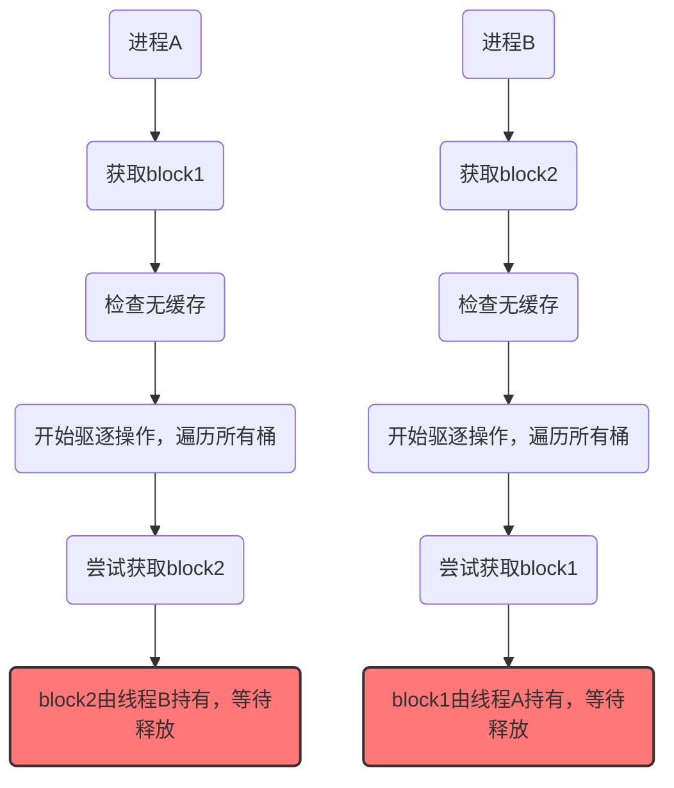
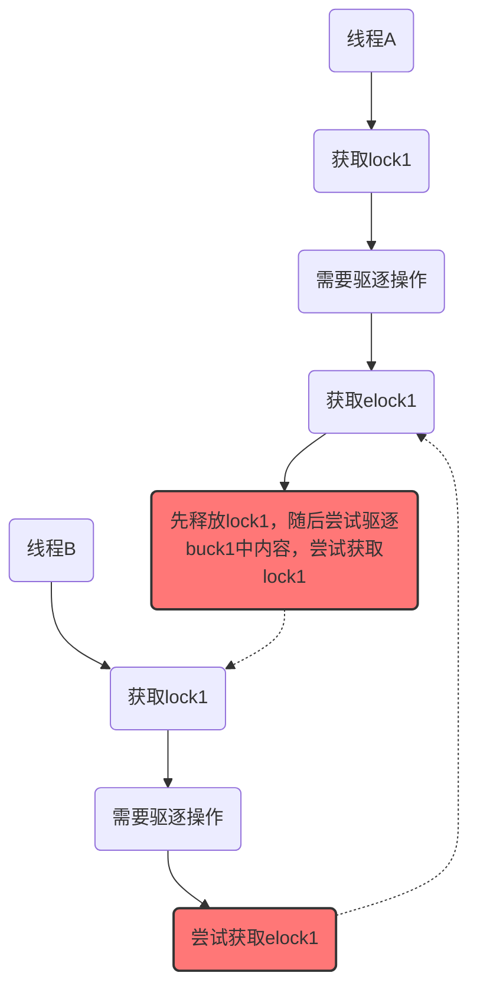

## 引言

MIT 6.s081 的 Locks 实验是一个极具挑战性的任务。它的难度不在于通过 `make grade` 的测试，而在于真正理解并发环境下锁的复杂性。测试用例可能无法覆盖所有潜在的竞争条件，正如那句名言所说：

> Tests can only prove the presence of bugs, not their absence.

这篇博客将记录我为优化 xv6 文件系统中的 `bcache.lock` 所做的全部思考，从最初的设计到遇到的各种陷阱（死锁、竞态条件），再到最终的解决方案。

## 读书笔记

在深入实验之前，必须厘清一个核心概念：线程代码和中断处理程序可能竞争同一个锁。这背后是两种截然不同的执行上下文。

> 笔记范围：xv6 book Chapter-6, Section 8.1 ~ 8.3

### 1. 线程上下文 (Thread Context)

- **定义**: 内核代码代表某个特定进程（在 xv6 中即一个内核线程）正常执行时的状态。例如，当一个进程通过系统调用进入内核，内核为其执行服务代码时，就处于该进程的线程上下文中。
- **特点**:
    - **可调度 (Schedulable)**: 可以被调度器暂停和恢复。
    - **可睡眠 (Can Sleep)**: 可以调用 `sleep()` 主动放弃 CPU 以等待资源（如磁盘 I/O），此时调度器会运行其他线程。
    - **可被中断**: 其执行过程可能随时被硬件中断打断。

### 2. 中断上下文 (Interrupt Context)

- **定义**: 当硬件（如定时器、磁盘）发出中断信号时，CPU 会强制暂停当前任何代码的执行，转而去运行预先注册的中断处理程序。这个执行环境就是中断上下文。
- **特点**:
    - **异步执行 (Asynchronous)**: 发生时间不可预测，由外部硬件决定。  
    - **不可调度 (Not Schedulable)**: 它不是一个线程，只是“借用”了当前被中断线程的内核栈。    
    - **不可睡眠 (Cannot Sleep)**: 中断处理程序必须尽快完成。如果在中断处理程序中调用 `sleep()`，系统将彻底卡死，因为它无法被重新调度来唤醒。更重要的是，在响应中断前，CPU通常会禁用（或推迟）新的中断，若处理程序自身陷入等待，将导致系统无响应。
        

### 上下文区别为何对锁至关重要？

如果一个锁保护的数据同时被这两种上下文访问，就可能导致**致命的死锁**。

**致命场景分析**:

1. 一个内核线程 T1 在**线程上下文**中运行，它成功获取了自旋锁 `lk`。
2. 在 T1 释放 `lk` 之前，同一个 CPU 核上发生了一个硬件中断（例如，时钟中断）。
3. CPU 硬件暂停 T1，切换到**中断上下文**，开始执行中断处理程序。
4. 不幸的是，该中断处理程序也需要访问被 `lk` 保护的数据，于是它尝试获取 `lk`。
5. **死锁发生**：
    - 中断处理程序在自旋，等待 `lk` 被释放。   
    - 但持有 `lk` 的线程 T1 已被该中断处理程序暂停，永远没有机会继续运行并释放 `lk`。    
    - 结果：中断处理程序永远在等待，被它中断的线程 T1 永远无法恢复。**整个 CPU 核被锁死。**    

### xv6 的解决方案

为了防止这种致命的死锁，xv6 规定了一种特殊的 `acquire` 锁的方式。当一个锁可能被中断处理程序使用时，在获取这个锁之前，**必须先在当前 CPU 核上禁用中断**。

xv6 的 `acquire()` 函数内部通过调用 `pushcli()` 来实现禁用中断。

```C
// acquire in spinlock.c
void
acquire(struct spinlock *lk)
{
  pushcli(); // 关键！在尝试获取锁之前，先禁用中断
  if(holding(lk))
    panic("acquire");

  while(xchg(&lk->locked, 1) != 0)
    ;
  
  // ...
}
```

这样一来，上面的死锁场景就不会发生： 因为线程 T1 在持有锁 `lk` 的期间，中断是禁用的，所以中断处理程序根本没有机会运行来尝试获取同一个锁。当中断被重新启用时（在 `release()` 函数中），锁 `lk` 肯定已经被释放了。

## 实验：`bcache`锁优化

### 目标与背景

在原始的 xv6 设计中，整个缓冲区缓存（buffer cache）由一个单一的全局锁 `bcache.lock` 保护。当多个进程密集地使用文件系统时，它们会激烈地争用这个锁，导致性能瓶颈。

`bcache.lock` 的作用是保护 `bcache` 的内部状态，避免出现以下冲突：
- 为同一个磁盘块（block）创建多个缓存 `buf`。
- 在并发访问时，对 `buf` 的元数据（如 `refcnt`、链表指针）的修改发生冲突。
    

**实验目标**：将 `bcache` 的单一**大锁**拆分为多个**小锁**，降低锁的粒度，提高并发性能。

**原始`bcache`结构**：

```c
struct {
struct spinlock lock;
struct buf buf[NBUF];
// Linked list of all buffers, through prev/next.
// Sorted by how recently the buffer was used.
// head.next is most recent, head.prev is least.
struct buf head;
} bcache;
```

**处理逻辑**：
- 通过一个`lock`锁来完成`bcache`的冲突控制
- 通过双向链表管理`buf`，实现`LRU`的驱逐策略
- 每次尝试获取`blockno`时，会遍历这个双向链表
	- 存在，直接返回，并`ref++`
	- 不存在，则找到最久未使用且`ref=0` 的`buf` 作为缓存

**核心思路**：
将 `buf` 数组进行**哈希分桶 (hashing/bucketing)**。为每个桶分配一把独立的锁。当需要访问某个 `blockno` 对应的 `buf` 时，只需锁住它所在的那个桶即可。在资源不足时再从其它桶中获取`buf`。
> 然而，这个看似简单的思路在实现时充满了陷阱。
#### 实验思路一

**结构设计**
对核心思路的直接实现，没有引入其它元素
```c
#define NBUCK 17

struct {
struct spinlock bucklock[NBUCK];
struct buf buf[NBUF];

// Linked list of all buffers, through prev/next.
// Sorted by how recently the buffer was used.
// head.next is most recent, head.prev is least.
struct buf head[NBUCK];
} bcache;
```

**逻辑流程**：
在 `bget()` 中，根据 `blockno` 计算哈希值 `h = hash(blockno)`，确定它属于哪个桶。
1. 获取桶 `h` 的锁 `bcache.lock[h]`。
2. 在桶 `h` 的链表中查找缓存。
    - 如果找到，增加引用计数，释放锁，返回 `buf`。    
    - 如果没找到，说明需要分配一个新的 `buf`。此时，**先从当前桶 `h` 中寻找空闲 `buf`**。
    - 如果当前桶也没有空闲 `buf`，则需要**跨桶窃取 (steal)** 一个。这时，需要遍历其他所有桶，寻找一个未被引用的 `buf` 来驱逐。

**实现思路**：
```c
static struct buf*
bget(uint dev, uint blockno)
{
  // 先获取桶lock，检测是否已经在桶内
  buck = (dev + blockno) % NBUCK;
  acquire(&bcache.bucklock[buck]);
  
  // 检查是否存在缓存
  for(b in bcache.head[buck]){
    if(b->dev == dev && b->blockno == blockno){
      b->refcnt++;
      release(&bcache.bucklock[buck]);
      setup(b);
      return b;
    }
  }

  // 在自己桶中完成驱逐分配操作
  evicte_self();
  if (b)
    goto evicted;

  for (int i in [0, NBUCK]) {
    acquire(&bcache.bucklock[i]);
    for (b in bcache.head[i]){
      if(b->refcnt == 0) {
        // 完成驱逐操作
        evict();
        release(&bcache.bucklock[i]);
        goto evicted; // 直接跳转，避免重复release
      }
    }
    release(&bcache.bucklock[i]);
  }

evicted:
  if (b)
    // 将b假如到buck桶内
    append(bcache.head[buck], b)
    // 设置b的属性
    setup(b);
	release(&bcache.bucklock[buck]);
    return b;

  release(&bcache.bucklock[buck]);
  panic("NO ENOUGH CACHE");
}
```

**存在的问题**
上述设计可能会存在死锁问题。
>做一个思维实验，假设有两个线程同时请求`bget`，线程A的在哈希后映射到 `buck 1`, 线程B在哈希后映射到`buck 2`



上述过程出现了**环路等待**的情况，陷入了死锁
想要破除死锁，可以考虑破除死锁条件的任意一条：
1. 互斥：在这里互斥条件是必须的，无法破坏
2. 请求保持
3. 不剥夺：剥夺会导致释放锁一方的bget请求失败，导致文件系统相关操作失败，不可行
4. 环路等待

> 再来考虑一下破除环路等待的可能，破除环路等待要求锁分配严格有序。一种可能的思路是在对`buck`加锁的时候，**按顺序从`buck 1`一直加锁到该`buck`**。这样可以做到加锁严格有序。但是无疑扩大了锁粒度，且让加锁操作大幅增加，会对性能产生较大的影响，因此也不能考虑。

因此上述方案中可能的只有破除**请求保持**这一条件，一种简单的思路是**在驱逐操作之前先释放持有的`buck`锁**。

#### 实验思路二
>在驱逐操作之前先释放持有的桶锁

上述问题中的请求会变为如下形式：


可以发现，上述设计成功破除了环路等待，不存在死锁的风险。


**存在的问题**
上述设计虽然消除了死锁的风险，但是在释放`buck`对应的锁后，破坏了对同一个`buck`进行`bget`操作的互斥性。

做一个思维实验：「线程A」和「线程B」同时对同一个`dev`的同一个`blockno`进行`bget`操作。「线程A」首先获取了桶锁，在该`buck`内检查发现「缓存不存在」，于是「释放桶锁」，进行「驱逐操作」。这时，「线程B」也获取了「桶锁」，**在「线程A」未完成「驱逐并将空buf放入桶内」这一操作之前，也检查发现「缓存不存在」**，也进入到「驱逐操作」中。最后会导致为**同一个区块分配多块缓存**。

#### 实验思路三
> 在破除环路等待条件的前提下，**保持「为统一区块进行驱逐分配操作的互斥性」**

1. 必须在进行「驱逐操作」前释放桶锁
2. 必须维持「为统一区块进行驱逐**分配**操作的互斥性」

直观的想上述内容要求我们需要为驱逐操作加锁，但是不能加桶锁，因此可以推断出此时我们需要一种新类型的锁，专门用于驱逐操作。
> 但是通过乐观锁的思想，也就是不加驱逐锁先做驱逐操作，做完后再检查，出问题再处理的思想，也是可以的。可以参考[他人blog评论区](（https://blog.miigon.net/posts/s081-lab8-locks/)

**结构设计**
```c
#define NBUCK 17

struct {
  // 驱逐操作专用锁
  struct spinlock elock[NBUCK];
  struct spinlock bucklock[NBUCK];
  struct buf buf[NBUF];

  // Linked list of all buffers, through prev/next.
  // Sorted by how recently the buffer was used.
  // head.next is most recent, head.prev is least.
  struct buf head[NBUCK];
} bcache;
```

**实现思路**

> 关键问题: elock上锁的时机

我最开始的想法是**在「驱逐操作」开始前的附近**位置加`elock`，有两种思路：
1. 在释放桶锁后加
2. 在释放桶锁前加

如果选择在释放桶锁「前」加驱逐锁，可能会产生此类操作，可能会造成`buck lock`和`eviction lock`的环路等待，造成死锁：


**因此这种设计必须要「先释放桶锁」再获取驱逐锁**

但是因为存在「释放桶锁」随后驱逐的操作，**重复分配的风险并没有完全消除**。

只能保证同一时间只能执行一次驱逐分配操作，但不能保证对同一区块的驱逐分配操作只执行一次。
> 打个比方。甲和乙都在帮丙打饭，他们先打电话问丙有没有人给你打过了（存在缓存），如果有人给你打过了，我就不打了。
> 在引入驱逐锁之前，可能会发生这样的情况，甲和乙先后问丙，得到的回复都是「没人给我打过饭」，甲和乙就各顾各的去帮丙打饭了（驱逐分配），最终丙拿到了两份饭（重复分配缓存）
> 在引入驱逐锁之后，并没有消除这种风险，只是甲和乙要排队打饭了。

解决的思路也很简单，让甲和乙在打饭前都在问丙一次「有没有帮你打过饭了」，因为甲和乙在排队，所以不存在同时打饭的情况。只要在轮到自己打饭前再问丙一次，就可以保证不会出现重复打饭的情况。

**我的实现**：
```c
static struct buf*
bget(uint dev, uint blockno)
{
  struct buf *b;

  // acquire(&bcache.lock);
  // 先获取桶lock，检测是否已经在桶内
  int buck = (dev + blockno) % NBUCK;
  acquire(&bcache.bucklock[buck]);
  // printf("acquire bucklock %d at line %d\n", buck, __LINE__);

  // Is the block already cached?
  for(b = bcache.head[buck].next; b != &bcache.head[buck]; b = b->next){
    if(b->dev == dev && b->blockno == blockno){
      b->refcnt++;
      // release(&bcache.lock);
      release(&bcache.bucklock[buck]);
      // printf("release bucklock %d at line %d\n", buck, __LINE__);
      acquiresleep(&b->lock);
      return b;
    }
  }

  /***
   * 不能在这里完成buck内的驱逐操作，不然可能会为同一个block分配多个buf
   * 假设有两个线程同时访问同一个block，
   * 线程1之前检查没有buf，在buck内也没有可以驱逐的buck
   * 线程1进入了对其它buck的驱逐操作，释放了buck的lock
   * 这时候有其它的线程进行了brealse操作，在该buck内释放了一个buf
   * 现在buck内有了一个空的buf
   * 线程2进入了bget，发现buck内有空的buf
   * 于是线程2在buck内完成了驱逐，分配了一个buf
   * 而线程1也在对其它buck的驱逐操作后，为该block分配了一个buf
   * 这时候就会出现同一个block有两个buf的情况
   * 所以不应该在这里进行驱逐操作
   * 总的来说**驱逐操作需要串行执行**，不管是对同一个buck还是不同的buck
   */
  // // 没有缓存，先检查head[buck]这个桶是否有空闲的buf
  // // 不需要acquire(&bcache.lock)了，因为已经获取了桶的lock
  // for (b = bcache.head[buck].prev; b != &bcache.head[buck]; b = b->prev){
  //   if(b->refcnt == 0) {
  //     // Found a free buffer.
  //     b->dev = dev;
  //     b->blockno = blockno;
  //     b->valid = 0;
  //     b->refcnt = 1;
  //     // Move to the head of the most-recently-used list.
  //     // 完成LRU操作
  //     b->next->prev = b->prev;
  //     b->prev->next = b->next;
  //     b->next = bcache.head[buck].next;
  //     b->prev = &bcache.head[buck];
  //     bcache.head[buck].next->prev = b;
  //     bcache.head[buck].next = b;

  //     release(&bcache.bucklock[buck]);
  //     acquiresleep(&b->lock);
  //     return b;
  //   }
  // }

  // 还是没有获取到buf，说明当前桶内没有空闲的buf
  // 需要驱逐一个buf，需要从其它桶内获取

  // 这里先release，在检查的时候再acquire是为了避免死锁
  release(&bcache.bucklock[buck]);
  // printf("release bucklock %d at line %d\n", buck, __LINE__);
  acquire(&bcache.elock[buck]);
  // printf("acquire elock %d at line %d\n", buck, __LINE__);
  // 其它线程完成驱逐操作后，可能已经分配了buf
  // 要做一次检查，防止重复对同一个block分配多个buf
  acquire(&bcache.bucklock[buck]);
  // printf("acquire bucklock %d at line %d\n", buck, __LINE__);
  for (b = bcache.head[buck].prev; b != &bcache.head[buck]; b = b->prev){
    if(b->dev == dev && b->blockno == blockno){
      b->refcnt++;
      // release(&bcache.lock);
      release(&bcache.bucklock[buck]);
      // printf("release bucklock %d at line %d\n", buck, __LINE__);
      release(&bcache.elock[buck]);
      // printf("release elock %d at line %d\n", buck, __LINE__);
      acquiresleep(&b->lock);
      return b;
    }
  }

  // 在这里完成对同buck的驱逐操作
  for (b = bcache.head[buck].prev; b != &bcache.head[buck]; b = b->prev){
    if(b->refcnt == 0) {
      // Found a free buffer.
      b->dev = dev;
      b->blockno = blockno;
      b->valid = 0;
      b->refcnt = 1;
      // Move to the head of the most-recently-used list.
      // 完成LRU操作
      b->next->prev = b->prev;
      b->prev->next = b->next;
      b->next = bcache.head[buck].next;
      b->prev = &bcache.head[buck];
      bcache.head[buck].next->prev = b;
      bcache.head[buck].next = b;

      release(&bcache.bucklock[buck]);
      // printf("release bucklock %d at line %d\n", buck, __LINE__);
      release(&bcache.elock[buck]);
      // printf("release elock %d at line %d\n", buck, __LINE__);
      acquiresleep(&b->lock);
      return b;
    }
  }

  // Still no free buffer, so recycle the least recently used buffer.
  // 还是没有获取到buf，说明当前桶内没有空闲的buf
  // 需要驱逐一个buf，需要从其它桶内获取
  release(&bcache.bucklock[buck]);
  // printf("release bucklock %d at line %d\n", buck, __LINE__);

  for (int i = 0; i < NBUCK; i++) {
    if (i == buck) continue; // 不要驱逐当前桶内的buf
    acquire(&bcache.bucklock[i]);
    // printf("acquire bucklock %d at line %d\n", i, __LINE__);
    for (b = bcache.head[i].prev; b != &bcache.head[i]; b = b->prev){
      if(b->refcnt == 0) {
        // Found a free buffer.
        b->dev = dev;
        b->blockno = blockno;
        b->valid = 0;
        b->refcnt = 1;
        // Move to the head of the most-recently-used list.
        // 完成LRU操作
        b->next->prev = b->prev;
        b->prev->next = b->next;
        b->next = 0;
        b->prev = 0;

        release(&bcache.bucklock[i]);
        // printf("release bucklock %d at line %d\n", i, __LINE__);
        goto evicted; // 直接跳转到释放elock的地方，避免重复release
      }
    }
    release(&bcache.bucklock[i]);
    // printf("release bucklock %d at line %d\n", i, __LINE__);
  }

evicted:
  if (b) {
    acquire(&bcache.bucklock[buck]);
    // printf("acquire bucklock %d at line %d\n", buck, __LINE__);
    b->next = bcache.head[buck].next;
    b->prev = &bcache.head[buck];
    bcache.head[buck].next->prev = b;
    bcache.head[buck].next = b;
    // 在将buf放入桶内之后，再释放elock
    release(&bcache.bucklock[buck]);
    // printf("release bucklock %d at line %d\n", buck, __LINE__);
    release(&bcache.elock[buck]);
    // printf("release elock %d at line %d\n", buck, __LINE__);
    acquiresleep(&b->lock);
    return b;
  }

  panic("bget: no buffers");
}
```

#### 后续思考

> 问题：elock加锁的时机

后续我考虑到如果在一开始就加入`elock`，似乎可以剔除后续检查的部分。
> 还是用甲乙帮丙打饭的例子。在之前的设计中，甲和乙「打电话询问」（检查缓存是否存在）和「打饭」（驱逐分配）的操作是分离的。
> 而如果在一开始就加入`elock`，则把「打电话询问」和「打饭」的操作原子化了（且互斥），如果甲先拨通了丙的电话（获取了`elock`），那么甲执行打饭操作。甲在打电话和打饭的过程中乙甚至无法拨通电话，更不会去打饭了。因此这样成功提出了二次检查的开销。

对这一点我也考虑过是否会增加开销，我的感觉是不会增加额外的开销。因为本来打电话就是互斥的，打饭也是互斥的。甲打完电话去打饭，乙最多执行完打电话这一步，而且乙有可能因此去执行打饭的操作，而他在打饭之前，还得再检查一次，到底甲有没有帮丙打饭，开销完全没有省去。
先加`elock`的性能似乎是更高的，而且由于`elock`是最先加的，且只在最开始加一次，因此也保证了锁分配的顺序，不会形成环路等待。
这是一种更优的设计。